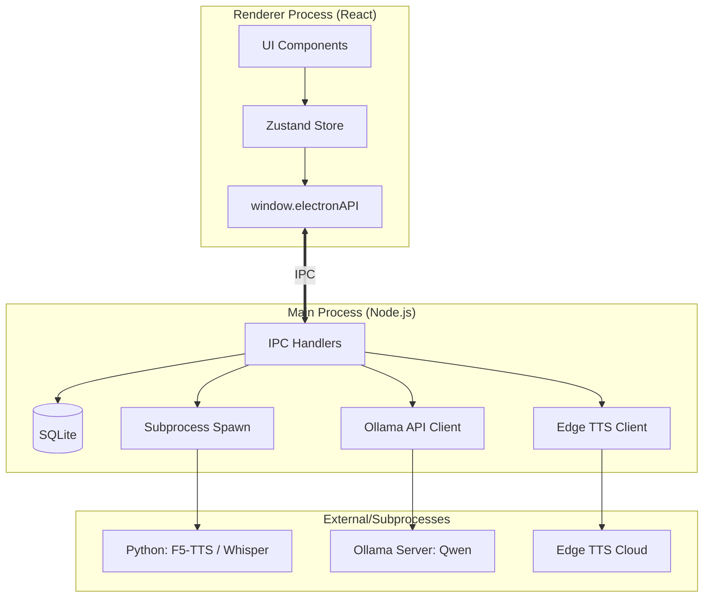

# System Architecture

## Process Model

## IPC Design
Namespaced communication via `contextBridge`:
- `db`: Database access (stats, history, settings).
- `voice`: Recording control (start/stop).
- `call`: Call lifecycle (dial, hangup).
- `model`: Model management (list, install).
- `tts`: Voice cloning and generation.
- `qwen`: LLM processing (text correction/extraction).

## Data Flow
1. **User records audio** -> Frontend sends WebM blob to Main.
2. **Main converts WebM to WAV** via ffmpeg.
3. **Main spawns `transcribe.py`** (Whisper) -> returns JSON text.
4. **Main sends text to Ollama** (Qwen) for correction/intent.
5. **Main spawns `f5_tts.py`** (F5-TTS) for response voice generation.
6. **Frontend plays generated WAV**.

## Security Model
- **Context Isolation**: Enabled.
- **Node Integration**: Disabled in renderer.
- **Path Validation**: All file operations (read/write/delete) are checked against allowed directories.
- **SQL Injection**: Prevented using prepared statements in `better-sqlite3`.

## Database Schema (SQLite)
- `settings`: Key-value store for app configuration.
- `calls`: History of calls (id, time, duration, status, transcript, audio_path).
- `models`: Registry of local/cloned models (id, name, type, path, status).
- **WAL Mode**: Enabled for high-performance concurrent reads/writes.
