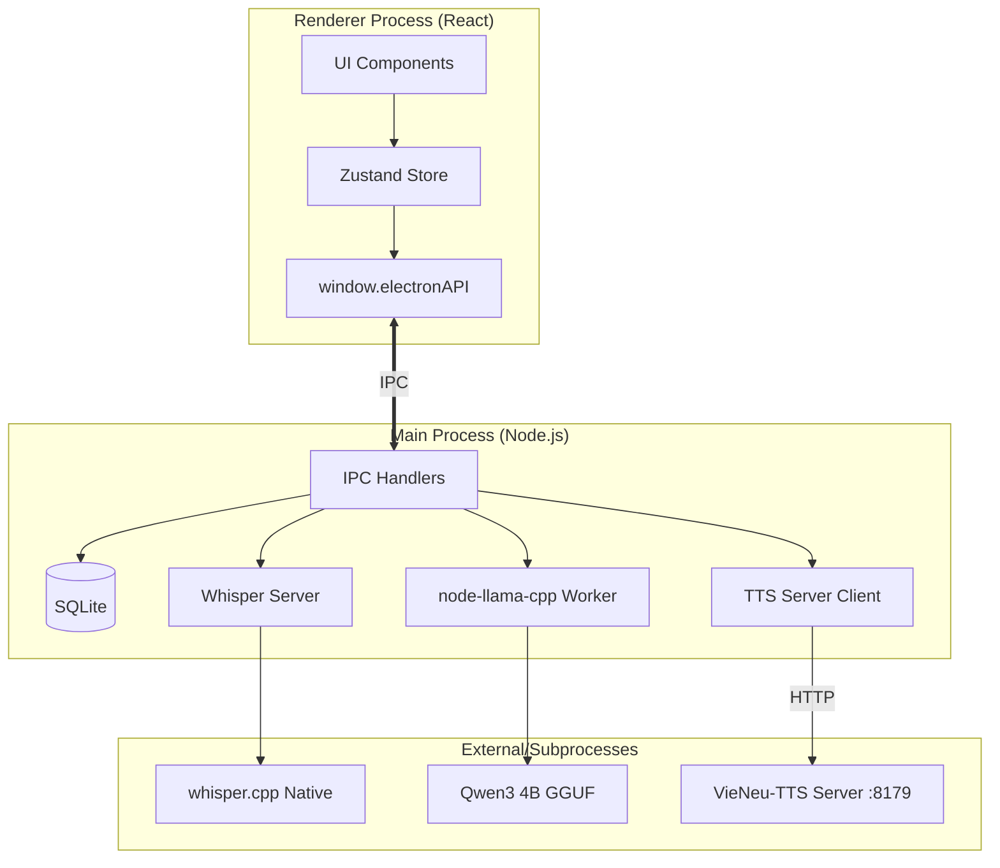

# System Architecture

## Process Model

```mermaid
graph TD
    subgraph "Renderer Process (React)"
        UI[UI Components]
        Store[Zustand Store]
        API[window.electronAPI]
    end

    subgraph "Main Process (Node.js)"
        IPC[IPC Handlers]
        DB[(SQLite)]
        WhisperSrv[Whisper Server]
        LLM[node-llama-cpp Worker]
        TTSClient[TTS Server Client]
    end

    subgraph "External/Subprocesses"
        WhisperCpp[whisper.cpp Native]
        Qwen[Qwen3 4B GGUF]
        VieNeu[VieNeu-TTS Server :8179]
    end

    UI --> Store
    Store --> API
    API <== IPC ==> IPC
    IPC --> DB
    IPC --> WhisperSrv
    IPC --> LLM
    IPC --> TTSClient
    WhisperSrv --> WhisperCpp
    LLM --> Qwen
    TTSClient -->|HTTP| VieNeu
```

## IPC Design
Namespaced communication via `contextBridge`:
- `db`: Database access (stats, history, settings, voices).
- `voices`: Voice profile CRUD (create, update, delete, list).
- `tts`: Voice generation and audio utilities.
- `qwen`: LLM processing via node-llama-cpp (text correction/extraction).
- `voice-chat`: Realtime voice conversation pipeline (STT → LLM → TTS streaming).
- `preload`: Model preloading and status management.

## Data Flow
1. **User records audio** -> Frontend sends WebM blob to Main.
2. **Main converts WebM to WAV** via ffmpeg.
3. **Whisper Server transcribes** (persistent whisper.cpp process) -> returns text.
4. **node-llama-cpp processes text** (Qwen3 4B) for correction/response.
5. **TTS Server generates speech** (VieNeu-TTS FastAPI on port 8179) -> returns WAV binary or SSE streaming.
6. **Frontend plays generated WAV** via AudioContext.

## Security Model
- **Context Isolation**: Enabled.
- **Node Integration**: Disabled in renderer.
- **Path Validation**: All file operations (read/write/delete) are checked against allowed directories.
- **SQL Injection**: Prevented using prepared statements in `better-sqlite3`.

## Database Schema (SQLite)
- `settings`: Key-value store for app configuration.
- `calls`: History of calls (id, time, duration, status, transcript, audio_path).
- `voices`: Voice profiles (id, name, audio_path, transcript).
- `training_data`: Banking domain knowledge entries.
- **WAL Mode**: Enabled for high-performance concurrent reads/writes.
